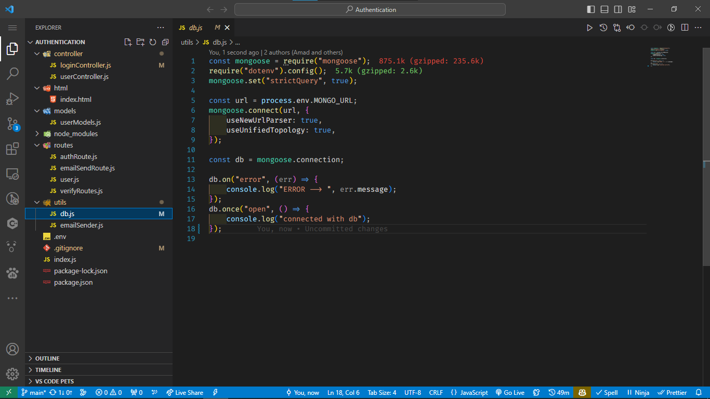
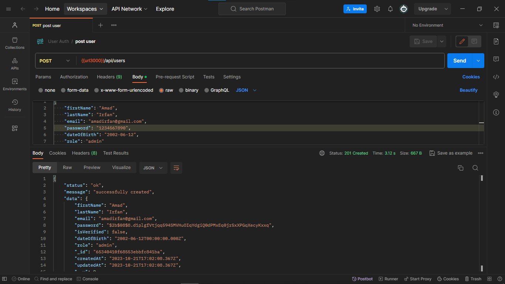
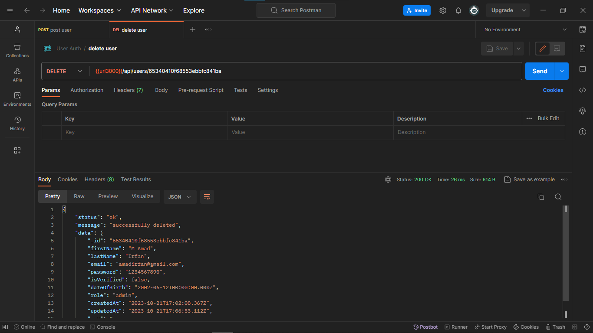
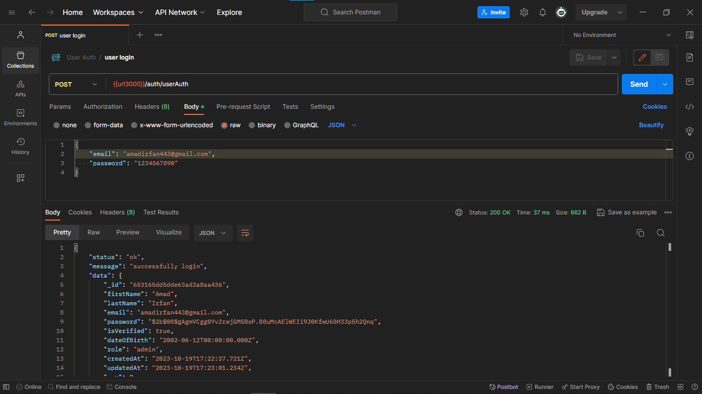

# Final Report:

___

|        Name         |   Amad Irfan   |
| :-----------------: | :------------: |
| **Registration No** | **2021-CS-25** |

**Directory Folders Screenshot : **



**Create Users Screenshot :**



**Update User screenshot :**


**Delete user Screenshot :**



**User Login Screenshot :**



#### Code :

`index.js` file code

``````js
const express = require("express");
const cors = require("cors");
const morgan = require("morgan");
const db = require("./utils/db");
const usersRoute = require("./routes/user");
const verify = require("./routes/verifyRoutes");
const authRoute = require("./routes/authRoute");
const app = express();
const email = require("./routes/emailSendRoute");
const bodyParser = require("body-parser");
require("dotenv").config();

app.use(cors());
app.use(bodyParser.json());
app.use(express.json());
app.use(morgan("dev"));


app.get("/", (req, res) => {
	res.send("Welcome to my Authentication app");
});
app.use("/api", usersRoute);
app.use("/verify", verify);
app.use("/auth", authRoute);
app.use("/sendEmail", email);

app.listen(process.env.PORT, () => {
	console.log("Server is running on port ", process.env.PORT);
});
	
``````


`db.js` code .

```javascript
const mongoose = require("mongoose");
require("dotenv").config();
mongoose.set("strictQuery", true);

const url = process.env.MONGO_URL;
mongoose.connect(url, {
	useNewUrlParser: true,
	useUnifiedTopology: true,
});

const db = mongoose.connection;

db.on("error", (err) => {
	console.log("ERROR --> ", err.message);
});
db.once("open", () => {
	console.log("connected with db");
});  

```

`loginController.js` code .

```javascript
const userModel = require("../models/userModels");
const bcrypt = require("bcrypt");
async function loginUser(req, res) {
	try {
		const { email, password } = req.body;
		let user = await userModel.findOne({ email });
		if (user) {
			const v = await bcrypt.compare(password, user.password);
			if (v) {
				res.status(200).json({
					status: "ok",
					message: "successfully login",
					data: user,
				});
 } else {
				res.status(404).json({
					status: "error",
					message: "Wrong Password. check your password ",
					data: req.body,
				});
			}
		} else {
			res.status(404).json({
				status: "error",
				message: "User with this email or password not exist",
				data: req.body,
			});
		}
	} catch (err) {
		res.status(302).json({
			status: "error",
			message: err.message,
			data: req.body,
		});
	}
}

module.exports = {
	loginUser,
};

```


`userController.js` code .

```javascript
const userModel = require("../models/userModels");

const encrypt = require("bcrypt");
const { sendEmail } = require("../utils/emailSender");

async function registerUsers(req, res) {
	try {
		let { email } = req.body;
		let userAlreadyExists = await userModel.findOne({ email });
		if (!userAlreadyExists) {
			const hashPassword = await encrypt.hash(req.body.password, 8);
			let createUser = {
				email: req.body.email,
				password: hashPassword,
				firstName: req.body.firstName,
				lastName: req.body.lastName,
				dateOfBirth: req.body.dateOfBirth,
				role: req.body.role,
			};
			const data = await userModel.create(createUser);
			let result = await sendEmail(
				email,
				"Register successfully",
				`You have been registered successfully in Authentication system. Please verify your email click on <a href='http://localhost:3000/verify/${data._id}'>verify</a>`
			);
			res.status(201).json({
				status: "ok",
				message: "successfully created",
				data: data,
			});
		} else {
			res.status(302).json({
				status: "error",
				message: "User with this email already exists",
				data: req.body,
			});
		}
	} catch (err) {
		res.status(500).json({
			status: "error",
			message: `internal error  ${err.message}`,
			data: null,
		});
	}
}

async function getUsers(req, res) {
	try {
		const data = await userModel.find();
		res.status(200).json({
			status: "ok",
			message: "success",
			data: data,
		});
	} catch (err) {
		res.status(500).json({
			status: "error",
			message: "internal error",
			data: null,
		});
	}
}

async function updateUsers(req, res) {
	try {
		const { id } = req.params;
		const data = await userModel.findByIdAndUpdate(id, req.body);
		res.status(200).json({
			status: "ok",
			message: "successfully updated",
			data: data,
		});
	} catch (err) {
		res.status(500).json({
			status: "error",
			message: "internal error",
			data: null,
		});
	}
}

async function deletesUsers(req, res) {
	try {
		const { id } = req.params;
		const data = await userModel.findByIdAndDelete(id);
		res.status(200).json({
			status: "ok",
			message: "successfully deleted",
			data: data,
		});
	} catch (err) {
		res.status(500).json({
			status: "error",
			message: "internal error",
			data: null,
		});
	}
}

module.exports = {
	registerUsers,
	updateUsers,
	deletesUsers,
	getUsers,
};

```


`userModels.js` code .

```javascript
const mongoose = require("mongoose");

const user = new mongoose.Schema(
	{
		firstName: { type: String, required: true },
		lastName: { type: String, required: true },
		email: { type: String, required: true, unique: true },
		password: { type: String, required: true },
		isVerified: { type: Boolean, required: true, default: false },
		dateOfBirth: { type: Date, required: true },
		role: { type: String, enum: ["superAdmin", "admin", "moderator"] },
	},
	{ timestamps: true }
);

module.exports = mongoose.model("users", user);
	
```


`authRoute.js` code .

```javascript
const express = require("express");
const { loginUser } = require("../controller/loginController");

const router = express.Router();

router.post("/userAuth", loginUser);

module.exports = router;

```


`emailSendRoute.js` code .

```javascript
const express = require("express");
const { sendEmail } = require("../utils/emailSender");
const router = express.Router();

router.get("/:email", async (req, res) => {
	try {
		const { email } = req.params;
		let result = await sendEmail(
			email,
			"Register successfully",
			"You have been registered successfully in Authentication system. Please verify your email click on <a href='http://localhost:3000/verify/id'>verify</a>"
		);
		res.send(result);
	} catch (err) {
		res.send(err.message);
	}
});

module.exports = router;

```


`user.js` code.

```javascript
const express = require("express");
const {
	registerUsers,
	updateUsers,
	deletesUsers,
	getUsers,
} = require("../controller/userController");
const router = express.Router();

router.get("/users", getUsers);
router.post("/users", registerUsers);
router.put("/users/:id", updateUsers);
router.delete("/users/:id", deletesUsers);

module.exports = router;

```


`verifyRoutes` code.

```javascript
const express = require("express");
const userModels = require("../models/userModels");
const { sendEmail } = require("../utils/emailSender");
const router = express.Router();

router.get("/:id", async (req, res) => {
	try {
		let { id } = req.params;
		let user = await userModels.findByIdAndUpdate(id, {
			$set: { isVerified: true },
		});
		if (!user.isVerified) {
			res.status(200).send({
				status: "ok",
				message: "successfully Verified your Email ...",
				data: {
					firstName: user.firstName,
					lastName: user.lastName,
					email: user.email,
					dateOfBirth: user.dateOfBirth,
				},
			});
		} else {
			res.status(200).send({
				status: "ok",
				message: "Email is Already verified.",
				data: {
					firstName: user.firstName,
					lastName: user.lastName,
					email: user.email,
					dateOfBirth: user.dateOfBirth,
				},
			});
		}
		await sendEmail(
			user.email,
			"Email Verified",
			"successfully Verified your Email ..."
		);
	} catch (err) {
		res.status(505).send({
			status: "error",
			message: "internal server error ",
			data: null,
		});
	}
});

module.exports = router;

```


`emailSender.js` code.

```javascript
const nodemailer = require("nodemailer");
require("dotenv").config();
async function sendEmail(email, subject, text) {
	try {
		const transporter = nodemailer.createTransport({
			port: process.env.NODE_PORT,
			service: process.env.SERVICE,
			host: process.env.HOST,
			secure: true,
			auth: {
				user: process.env.EMAIL,
				pass: process.env.EMAIL_PASSWORD,
			},
		});
		await transporter.sendMail({
			from: `AMADIRFAN <${process.env.EMAIL}>`,
			to: email,
			subject: subject,
			html: `	<h3>${text}</h3>`,
		});
		return "email sent successfully";
	} catch (err) {
		return err.message;
	}
}
module.exports = {
	sendEmail,
};
	
```


### *The End*


